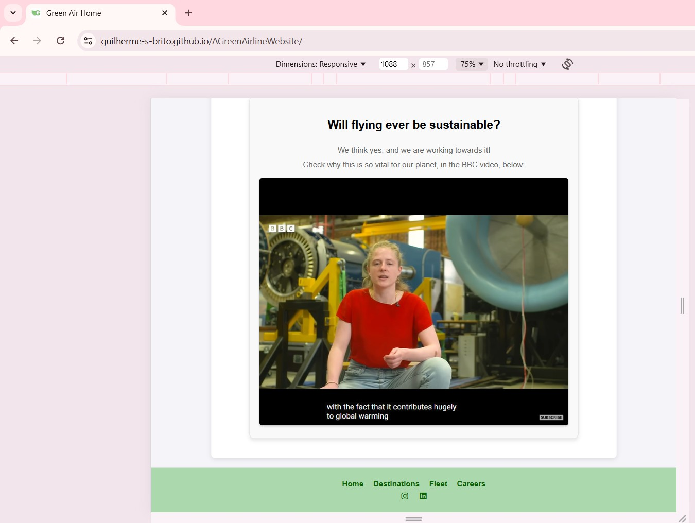
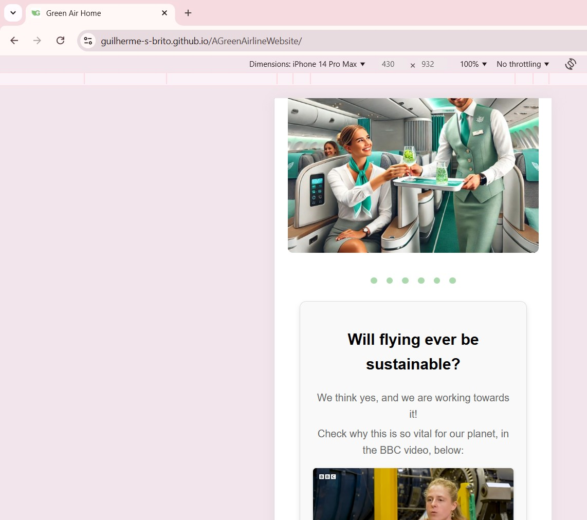
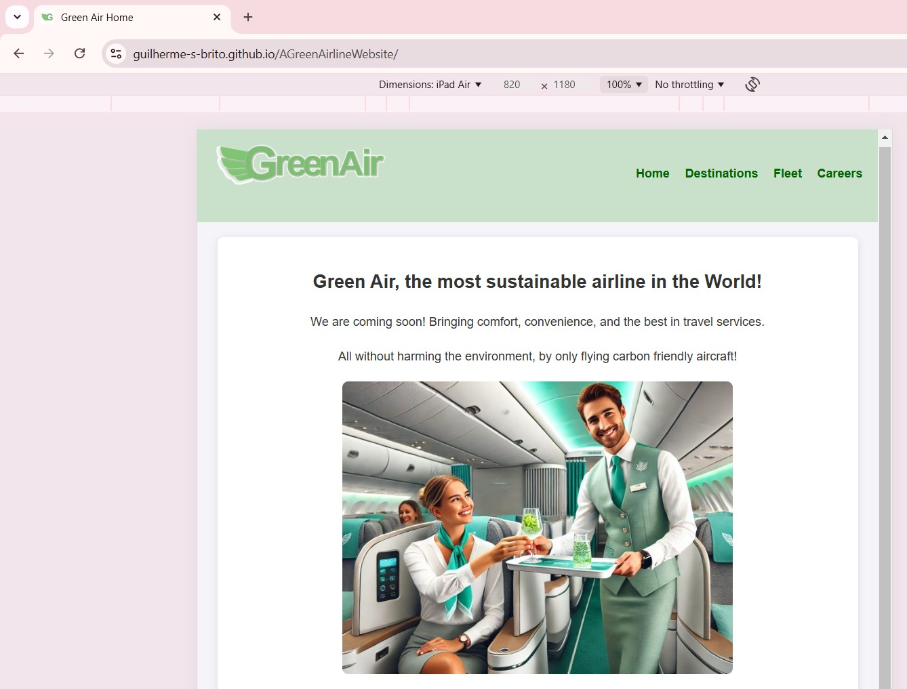
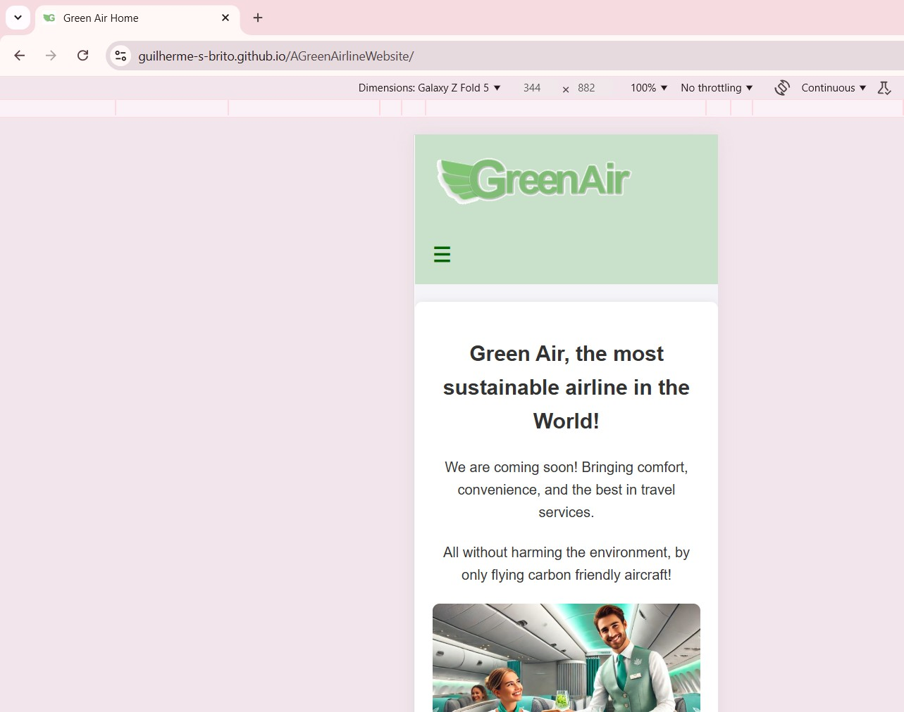
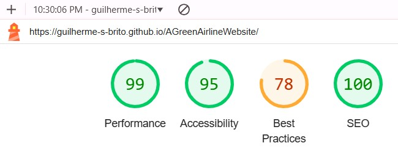
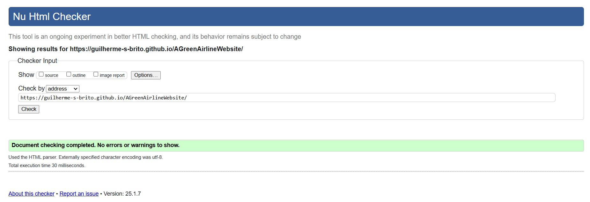
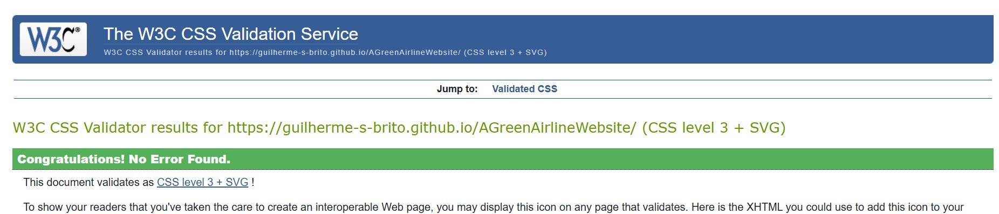
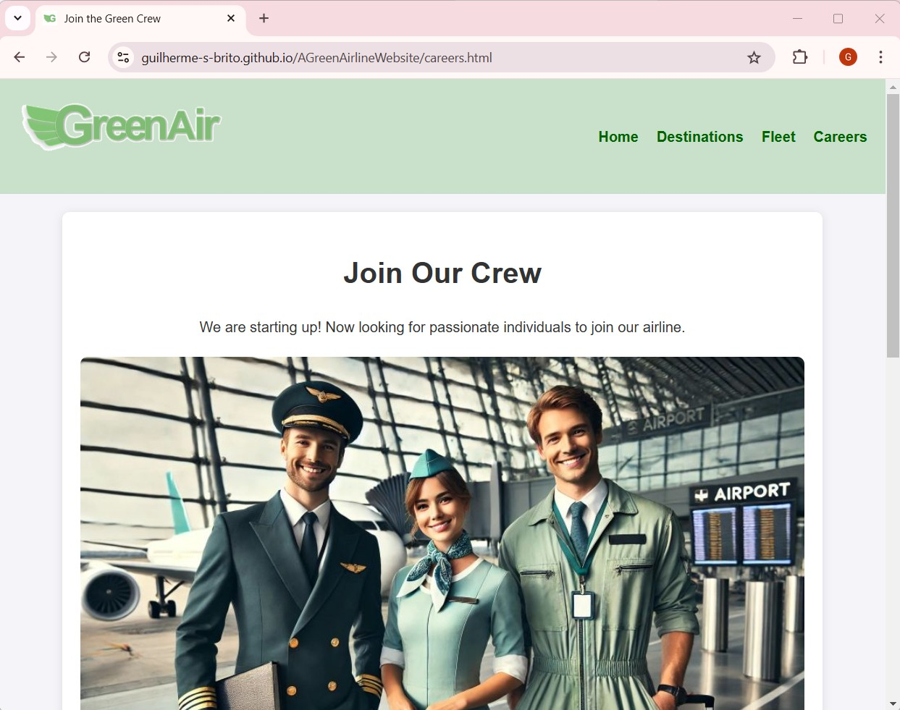
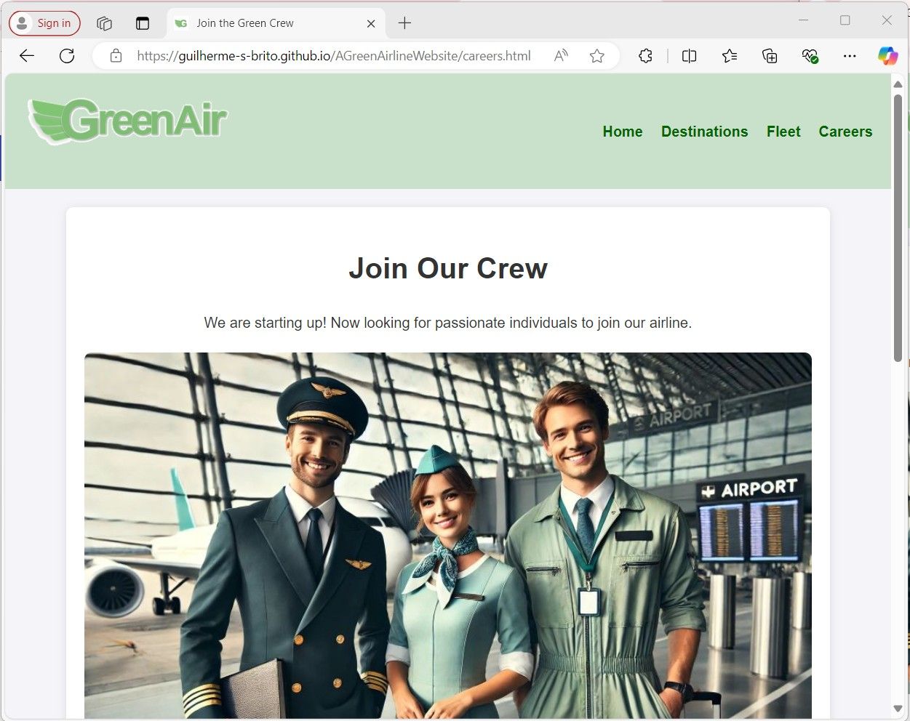
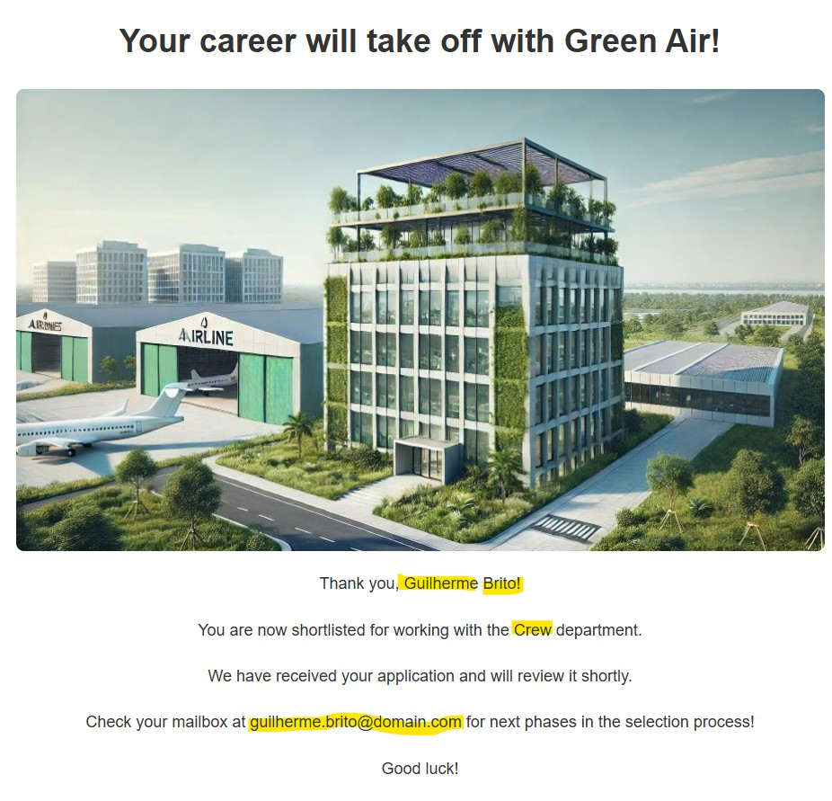

# Code Institute - Project 01 Submission
Student: Guilherme Santos Brito,

The intent of the project is to build an Website for a mock Airline, named Green Air. 
This airline has the goal of being the most sustainable in the world. 
Users can watch an embedded BBC video on the importance of making aviation sustainable. 
In the moment, it has some product ideas depicted in the main page, its gitst list of 6 destinations and 4 types of aircraft. 
It is attracting talent ofr its start-up recruiting for its Adminstrative, Crew and Airports departments. 
Candidates who fill the form receive candidacy confirmation and are asked to monitor their e-mails about application status.

## Features

-Navigation bar, with clickable logo and adapted to mobile devices with "hamburger" menu; 
-Image slider in the landing page; 
-Embedded youtube video, with audio/video controls. For user convenience, its audio is auto turned off and closed-captions are displayed; 
-Fleet and Destination pages have hover sensitive styling; 
-Careers page has a functioning form, with input validation and dropdown selection of departments; 
-Inputs are then displayed again in the application confirmation; 
-Footer navigation; 
-Social media links; 
-Keywords for Search engines. 
-Favicon. 

## Future Developments

Future developments may come by next projects like:  
-implementation of dynamic route maps, or  
-emissions calculation depending on each aircraft chosen by user. 

## Release History
Version history:

January, 7 - 2025, latest Deployment 
Close to 30 iterations were commited to reach the latest deployed status. 
History available on: https://github.com/Guilherme-S-Brito/AGreenAirlineWebsite/deployments 

## Testing and Code Validation
Responsiveness checked via Chrome DevTools 

a) Laptop

b) Iphone 14 Pro Max

c) Ipad Air

d) Galaxy Z Fold

## Lighthouse

Checked via Chrome for Desktop, accessed via DevTools:

High numbers for Performance, Acessibility and SEO.

Medium points, 78, on Best Practices due to cookies required from the embeddeding of YouTube.

## Bugs

Image slider had misalignment in higher resolutions or percentage stopping points.
Solved by reducing image size and fixing the image caroussel stopping points in pixels.

## Code Validation

a) HTML, via https://validator.w3.org

No errors identified per the evidence below:

b) CSS, via https://jigsaw.w3.org/css-validator/

No errors identified per the evidence below:

## Browser Compatibility
Tested on following Navigators:

a) Google Chrome and,

b) Microsoft Edge

## Feature Testing

All links, buttons and forms were manually tested.

As an illustrative example, a picture of the careers form confirmation page:

## References and Credits

a) Video from:  BBC, March 2024. Will flying ever be sustainable?  https://www.youtube.com/watch?v=rYqUDuQnFvw ;

b) W3 Schools: https://www.w3schools.com/html/html_youtube.asp

b) Logo created by the student;

c) Images created with DallE / OpenAi;

d) Footer elements from Code Institute "Love Running" example website;

e) Footer icons from: https://fontawesome.com/;

f) AI tools like Perplexity and OpenAi were used for coding assistance, sources stated in the code and below:

g) Image slider https://www.thecoderashok.com/blog/automatic-image-slider-in-html-css-only found via Perplexity

h) Application form troubleshooting

i) CSS troubleshooting also with OpenAi assistance

## Deployment
The site was deployed to GitHub pages. The steps to deploy are as follows:

a) In the GitHub repository, navigate to setting tab;

b) From the source section drop-down menu, select the Master Branch;

c) Once the master branch has been selected, the page provided the link to the completed website